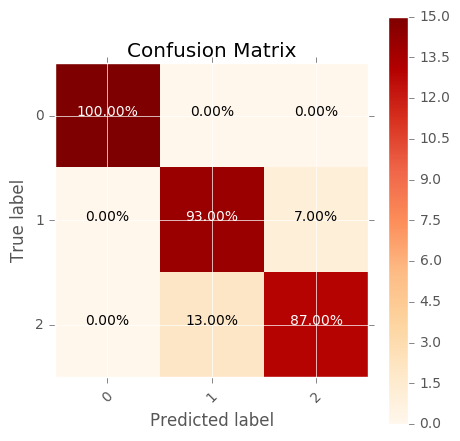

# Usage Examples
## creating iris-colored_acatter_matrix
You can create colored_acatter_matrix very easily ( 3 lines of code):
```python
    plotter=DataPlots(df=iris_df, ggplot=True)
    fig=plotter.colored_scatter_matrix(df=iris_df,colored_column_name="Target")
    fig.savefig("iris-colored_acatter_matrix.png")
```
[show me the complete code](iris-colored_acatter_matrix.py)

## simple example of iris dataset classification python
[show me the code](modelutil_simple_usage.py)
- load iris dataset
- create a DecisionTreeClassifier
- create a ModelUtils
```python
        prd_lbl, actl_lbl = "PrdictedIrisClass", "IrisClass"
        mu = ModelUtils(
                df            = iris_df,
                clf           = tree_clf,
                predicted_lbl = "PrdictedIrisClass",
                actual_lbl    = "IrisClass"
                )
```
- split and train the clf
```python
        mu.split_and_train()
```
- test the model
```python
        results_df = mu.test_model()
```
- evaluate results using plot_confusion_matrix
```python
        evp = EvaluationPlots(df=results_df, actual_lbl=mu.actual_lbl, predicted_lbl=mu.predicted_lbl)
        evp.plot_confusion_matrix(confusion_matrix=mu.confusion_matrix(), classes_lst=mu.clf.classes_)
        plt.savefig("confusion_matrix.png", bbox_inches='tight')
```
    resulting this plot:
    

