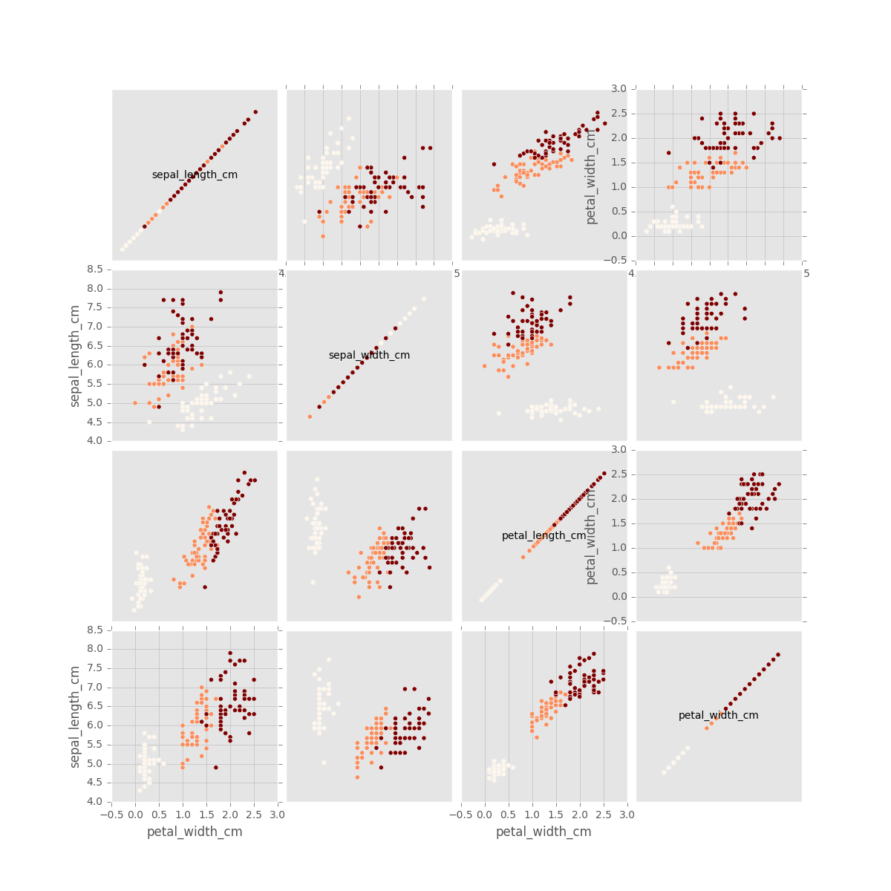

# MachineLearningUtils
A set of  useful tools for machine learning projects

## [UsefulPlots](UsefulPlots)
Asset of useful plots classes:
- DataPlots
- VisPlotPlayGround

### DataPlots
Some useful plots for data exploration:
- colored_scatter -  Plot scatter of x vs y with color of third element
- colored_scatter_matrix - A matrix of colored_scatter

### EvaluationPlots
plot that helps to evaluate models
- predicted_vs_actual - This method creates sctter plot of
                        predicted values vs the actual valus.

### VisPlotPlayGround
playground for visualization (color map and more...)
- show_colormap - Show the gradiant of cmap
- grayify_cmap  - Return a grayscale version of the colormap

### DatasetsTools
easyier skitlearn dataset exploration mainly for unittests and demos
- data_as_df

### Examples:
#### UsefulPlots.DataPlots.colored_scatter_matrix: [(show me the code...)](Examples/iris-colored_acatter_matrix.py)

